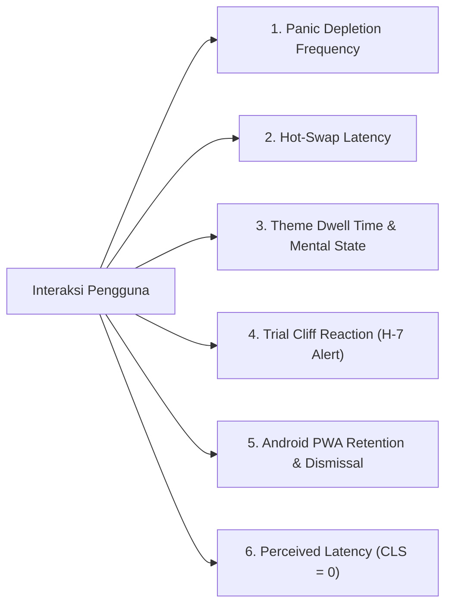
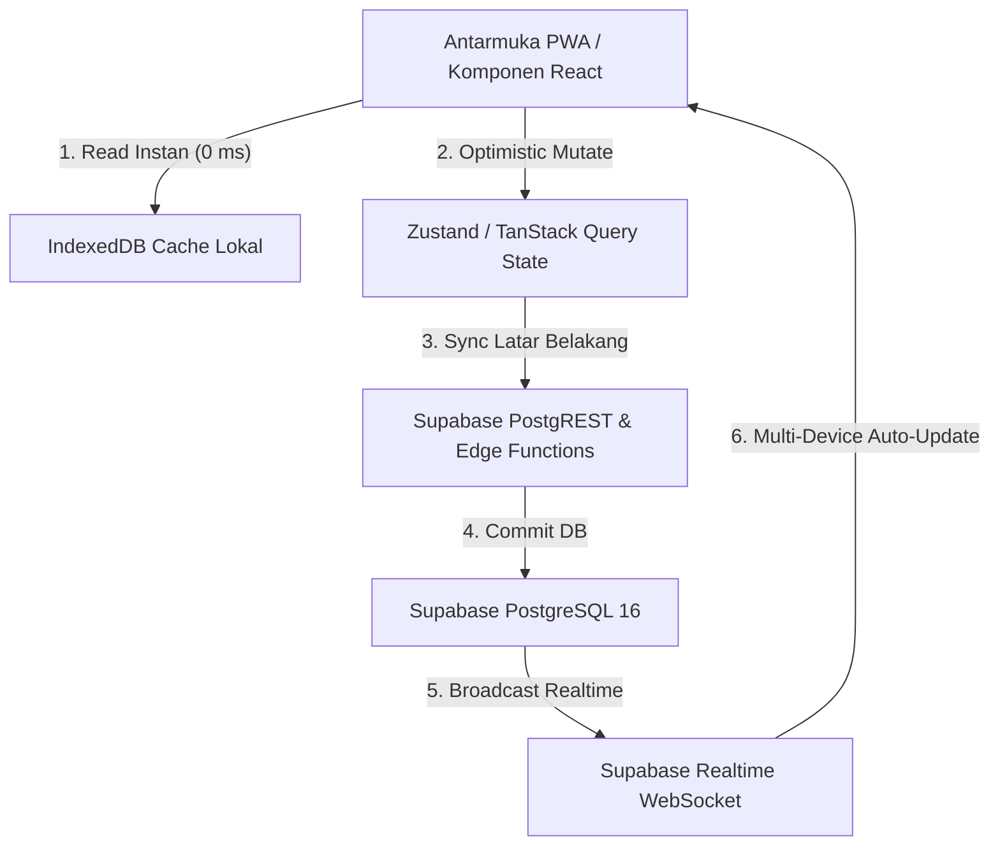

# Product Requirements Document (PRD)
## Project: ChronosAI (AI Agent Reset & Subscription Pulse)
### Cross-Platform PWA for Multi-Agent Quota Reset & Subscription Management

---

| Document Metadata | Detail |
| :--- | :--- |
| **Project Name** | **ChronosAI** (Weekly & Rolling AI Reset & Subscription Watcher) |
| **Document Version** | `v2.1.0` (Monorepo Architecture, HTML Blueprint First Policy Gate, UI-Only Scope) |
| **Author** | Senior Product Manager, Genjutsu Design Architect & Enterprise System Engineer |
| **Status** | Approved for Monorepo Structure & Living Design Blueprint |
| **Monorepo Structure** | 📦 Root (`package.json` workspaces), 🎨 `design/` (HTML Blueprint), 💻 `apps/web` (Next.js 15 UI Only) |
| **Target Platforms** | 📱 **Android Only** (PWA / WebAPK / TWA via Chromium) & 💻 **Desktop/Laptop Web** *(iOS is strictly excluded)* |
| **Tech Stack Foundation** | Monorepo / Next.js 15+ (App Router) / React 19 / TypeScript (Strict) / Tailwind CSS |
| **Living Prototype Contract** | [design/prototype.html](file:///c:/Users/ASUS/Documents/Web%20Dev/improving/notifikasi-weekly-reset-gemini/design/prototype.html) |
| **Design Engines Applied** | Genjutsu (`@paint`, `@cast`), Magic UI, Three.js 3D, Motion (Disney Principles) |
| **Themes Supported** | 1. 🎀 Kawaii Dream (Feminine Pastel) \| 2. 💀 Cyber-Virus Matrix \| 3. 💎 Obsidian Pro High-Tech |
| **Notification Architecture** | 📱 **Android**: Native Web Push (VAPID) + Haptic Feedback (`navigator.vibrate`) <br> 💻 **Desktop/Laptop**: In-App Slide-Over Drawer (Read/Unread Toggle) |
| **Backend Scope** | ⏸️ **DITUNDA (Pending User Confirmation)** — Fokus monorepo saat ini 100% pada tampilan antarmuka (UI). |

---

## 1. Executive Summary

**ChronosAI** adalah aplikasi Progressive Web App (PWA) generasi baru yang dirancang untuk memantau kuota mingguan/rolling akun AI (Antigravity, Claude Code, Cursor, OpenCode, Gemini, OpenAI Codex) serta manajemen siklus penagihan langganan finansial.

Pembaruan arsitektur v1.5.0 menyelesaikan kendala antarmuka dan interaksi riil:
1. **Zero Overlap Notification Center (Pusat Notifikasi Slide-Over Drawer)**:
   * Mengeliminasi dropdown yang bertumpukan (*overlapping/clipping*) dengan menggantinya menjadi **Slide-Over Drawer** elegan dengan latar belakang *backdrop blur* (`z-[60]`).
   * Pengguna dapat memfilter pesan *Semua* vs *Belum Dibaca*, menandai pesan dibaca/belum dibaca, dan mengeklik notifikasi untuk langsung berpindah ke akun atau tagihan yang relevan.
2. **Armada Data Produksi Riil (Production Dataset)**:
   * Pengujian semi-final menggunakan data 5 agent AI riil di dunia rekayasa perangkat lunak:
     * **Antigravity (Google DeepMind)**: Kuota pool mingguan (Senin 07:00 UTC), masa trial 4 bulan gratis (Jatuh tempo H-7 aktif, bulan ke-5 bayar $30.00/bln).
     * **Claude Code (Anthropic)**: Rolling window 5 jam ($20.00/bln).
     * **Cursor Pro (Anysphere)**: 500 fast requests pool bulanan (Promo $15.00/bln).
     * **OpenCode (Open-Source Cluster)**: Qwen 2.5 72B / DeepSeek-Coder-V2 rolling 24 jam ($0.00 Self-Hosted).
     * **OpenAI Codex / ChatGPT Team**: GPT-4o & o3-mini rolling 3 jam ($25.00/bln).
3. **Fungsionalitas Interaktif Lengkap (Interactive Completeness)**:
   * Setiap tombol memiliki aksi nyata: **Edit Konfigurasi Akun** (memunculkan modal edit dan menyimpan perubahan), **Hapus Akun**, **Limit Kena Sekarang!**, **Tambah Langganan**, dan **Uji Coba Push HP**.
4. **Smart Fleet Typewriter & Auto-Typing Engine (RULES.md Rule 1.3)**:
   * Menggantikan teks statis pada headline rekomendasi cerdas dengan animasi mengetik otomatis karakter demi karakter.
   * Dilengkapi kursor berkedip GPU-accelerated (`|` / `█`), zero layout shift (`min-h-[32px]`), text-scramble decoding effect untuk tema Cyber Matrix, dan rotasi otomatis antar armada siap pakai.

---

## 2. Living Interactive Prototype Blueprint (`design/prototype.html`) & Monorepo Workflow

Berkas **[design/prototype.html](file:///c:/Users/ASUS/Documents/Web%20Dev/improving/notifikasi-weekly-reset-gemini/design/prototype.html)** adalah acuan wajib (*Single Source of Truth*) yang menyajikan alur semi-final aplikasi dan bertindak sebagai **gerbang utama (Policy Gate)**:
* **HTML Blueprint First Policy**: Setiap ide baru, fitur tambahan, atau revisi alur antarmuka **WAJIB** diimplementasikan terlebih dahulu pada berkas tampilan kasar HTML ini sebelum disentuh ke dalam basis kode monorepo.
* **Human-in-the-Loop Confirmation**: AI **DILARANG** memindahkan/mengimplementasikan kode ke project monorepo (`apps/web`) sebelum pengguna mereview dan memberikan persetujuan eksplisit.
* **Struktur Monorepo Terisolasi**:
  * `design/`: Ruang eksplorasi dan purwarupa HTML kasar tanpa dependensi rumit.
  * `apps/web`: Implementasi tampilan Next.js 15 PWA berbasis TypeScript dan Tailwind CSS (khusus UI, tanpa backend).
  * `backend`: Ditunda pengerjaannya sampai instruksi eksplisit berikutnya.
* Pusat notifikasi laptop berupa Slide-Over Drawer dengan backdrop yang bersih dan bebas tumpang tindih.
* Headline rekomendasi armada mengetik sendiri secara dinamis dengan kursor aktif (*typewriter animation engine*).
* Form edit dan tambah akun yang berfungsi secara reaktif (*CRUD in-memory state*).
* Tabel langganan dinamis yang otomatis menghitung ulang *Monthly Burn Rate*.

---

## 3. Fitur Utama & Functional Requirements (Epics)

### 3.1 EPIC 1: Master Data Provider & Smart Presets
* Antigravity (7 hari pool), Claude Code (5 jam rolling), Cursor (500 fast requests), OpenCode (24 jam cluster), OpenAI Codex (3 jam rolling).

### 3.2 EPIC 2: Multi-Account Management per Provider (Full CRUD)
* Menautkan, mengedit konfigurasi, dan menghapus akun agent dari armada.

### 3.3 EPIC 3: Precision Reset & Rolling Window Engine
* Mode jadwal mingguan/bulanan (tahan DST & IANA Timezone).
* Mode Rolling Window dengan tombol aksi cepat **"Limit Kena Sekarang!"** yang langsung memulai hitungan mundur dan memicu efek partikel.

### 3.4 EPIC 4: Smart Fleet Recommender (Readiness Matrix & Typewriter Engine)
* Status Kesiapan: 🟢 `READY NOW (100%)`, 🟡 `RESET IMMINENT`, 🔴 `RECHARGING`.
* Banner rekomendasi cerdas yang menunjuk akun terbaik untuk dipakai saat ini.
* **Typewriter & Auto-Typing Engine (RULES.md Rule 1.3)**:
  - **Zero CLS**: Container headline memiliki tinggi minimum terkunci (`min-h-[32px]`) sehingga tidak terjadi pergeseran layout saat karakter diketik dari panjang 0 hingga penuh.
  - **Blinking Cursor**: Animasi CSS `@keyframes` opacity murni dengan indikator `|` (Kawaii/Obsidian) dan `█` (Cyber-Virus Matrix).
  - **Kecepatan Organik**: Cadence pengetikan bervariasi secara alami antara 45ms - 75ms per karakter, dengan fast-delete 22ms per karakter.
  - **Cyber-Scramble Decoding**: Karakter pada mode hacker didekripsi acak dari simbol matriks (`!@#$%^&*<>_01X#`) sebelum mengunci ke huruf asli.
  - **Rotasi Cerdas & Timeout Cleansing**: Berotasi otomatis antar akun siap pakai dengan jeda baca 4.5 detik dan pembersihan `clearTimeout` aman saat perpindahan tema.

### 3.5 EPIC 5: Subscription Lifecycle, Durasi & Promo Engine (Diskon & Trial)
* Input tanggal awal (`start_date`), durasi (`duration_months`), dan skema promo (Reguler, Diskon, atau Trial 4 bulan gratis).
* Sistem otomatis menghitung `end_date` dan memicu peringatan **H-7**, **H-3**, dan **H-1**.

### 3.6 EPIC 6: Dual Notification Engine (Android Web Push vs Desktop Slide-Over Drawer)
* 📱 **Mobile (Android PWA Only)**:
  * Menggunakan standar **Web Push API (VAPID)** via Chromium Service Worker tanpa dependensi APNs/iOS.
  * Native banner push notifikasi saat **H-2 jam** sebelum reset kuota dan **H-7/H-3** sebelum masa aktif langganan habis.
  * **Android Haptic Feedback**: Integrasi `navigator.vibrate([100, 50, 100])` saat alert penting diterima di smartphone Android.
  * **Notification Actions**: Tombol cepat *"Hot-Swap Akun"* langsung di dalam banner notifikasi Android.
* 💻 **Desktop / Laptop Web**:
  * Pusat Notifikasi Slide-Over Drawer elegan (z-index 90 dengan backdrop blur).
  * Filter tab (*Semua* vs *Belum Dibaca*), *Mark All as Read*, dan aksi navigasi 1-klik ke akun terkait.

### 3.7 EPIC 7: Data Portability (Export & Import JSON)
* Ekspor dan impor data tervalidasi skema Zod dengan hash checksum anti-korupsi.

### 3.8 EPIC 8: Android Dedicated PWA & Mobile UX Optimization
* **WebAPK Installation**: Mendukung instalasi native home screen Android via Chromium WebAPK dengan splash screen dan icon adaptive maskable.
* **Ergonomi Jempol (Thumb Zone)**: Floating Bottom Navigation bar khusus tampilan Android viewport (Dashboard, Armada, Langganan, Notifikasi).
* **Android Back Button Lifecycle**: Tombol back fisik/gesture Android menutup modal/drawer aktif terlebih dahulu sebelum memicu navigasi mundur halaman.
* **App Badging API**: Menampilkan angka counter notifikasi belum dibaca langsung di atas ikon aplikasi di launcher Android (`navigator.setAppBadge`).
* 🚫 **Zero iOS Policy**: Tidak menyediakan kompromi arsitektural untuk iOS Safari/WebKit (menghilangkan friksi sertifikat Apple Developer, restriksi PWA background sync iOS, dan limitasi audio context).

---

## 4. Database Schema & Data Models (Supabase PostgreSQL 16)

```sql
-- 1. EXTENSIONS & ENUMS
CREATE EXTENSION IF NOT EXISTS "uuid-ossp";
CREATE TYPE reset_cycle_type AS ENUM ('HOURLY', 'DAILY_CALENDAR', 'WEEKLY_CALENDAR', 'MONTHLY_CALENDAR', 'ROLLING_WINDOW', 'CUSTOM_HOURS');
CREATE TYPE subscription_status_type AS ENUM ('ACTIVE', 'TRIAL', 'PAUSED', 'CANCELLED');
CREATE TYPE pricing_scheme_type AS ENUM ('REGULAR', 'DISCOUNTED', 'TRIAL_THEN_PAID');
CREATE TYPE account_readiness_type AS ENUM ('READY', 'RESET_IMMINENT', 'RECHARGING');
CREATE TYPE app_theme_type AS ENUM ('HACKER', 'CUTE', 'OBSIDIAN');
CREATE TYPE notif_category_type AS ENUM ('RESET_ALERT', 'SUBSCRIPTION_H7', 'SUBSCRIPTION_H3', 'SYSTEM');

-- 2. PROVIDERS
CREATE TABLE public.providers (
    id UUID PRIMARY KEY DEFAULT uuid_generate_v4(),
    slug VARCHAR(50) UNIQUE NOT NULL,
    name VARCHAR(100) NOT NULL,
    category VARCHAR(50) NOT NULL DEFAULT 'CODING_AGENT',
    logo_svg_url TEXT NOT NULL,
    brand_color_hex VARCHAR(10) NOT NULL DEFAULT '#6366f1',
    default_reset_cycle reset_cycle_type NOT NULL DEFAULT 'WEEKLY_CALENDAR',
    default_interval_hours NUMERIC(6,2) NOT NULL DEFAULT 168.00,
    preset_notes TEXT,
    is_active BOOLEAN NOT NULL DEFAULT true,
    created_at TIMESTAMPTZ NOT NULL DEFAULT NOW()
);

-- 3. AGENT ACCOUNTS
CREATE TABLE public.agent_accounts (
    id UUID PRIMARY KEY DEFAULT uuid_generate_v4(),
    user_id UUID NOT NULL REFERENCES auth.users(id) ON DELETE CASCADE,
    provider_id UUID NOT NULL REFERENCES public.providers(id) ON DELETE RESTRICT,
    account_label VARCHAR(100) NOT NULL,
    account_identifier_masked VARCHAR(100),
    reset_cycle reset_cycle_type NOT NULL DEFAULT 'WEEKLY_CALENDAR',
    interval_hours NUMERIC(6,2) NOT NULL DEFAULT 168.00,
    anchor_day_of_week INT DEFAULT 1,
    anchor_time TIME NOT NULL DEFAULT '00:00:00',
    anchor_timezone VARCHAR(50) NOT NULL DEFAULT 'UTC',
    last_depleted_at TIMESTAMPTZ,
    next_reset_at TIMESTAMPTZ NOT NULL,
    readiness_status account_readiness_type NOT NULL DEFAULT 'READY',
    is_active BOOLEAN NOT NULL DEFAULT true,
    created_at TIMESTAMPTZ NOT NULL DEFAULT NOW()
);

-- 4. SUBSCRIPTIONS
CREATE TABLE public.subscriptions (
    id UUID PRIMARY KEY DEFAULT uuid_generate_v4(),
    user_id UUID NOT NULL REFERENCES auth.users(id) ON DELETE CASCADE,
    account_id UUID REFERENCES public.agent_accounts(id) ON DELETE SET NULL,
    provider_id UUID NOT NULL REFERENCES public.providers(id) ON DELETE RESTRICT,
    plan_name VARCHAR(100) NOT NULL,
    pricing_scheme pricing_scheme_type NOT NULL DEFAULT 'REGULAR',
    regular_amount NUMERIC(12, 2) NOT NULL DEFAULT 0.00,
    discounted_amount NUMERIC(12, 2),
    is_trial BOOLEAN NOT NULL DEFAULT false,
    trial_duration_months INT DEFAULT 0,
    paid_start_month INT DEFAULT 1,
    currency VARCHAR(5) NOT NULL DEFAULT 'USD',
    start_date DATE NOT NULL DEFAULT CURRENT_DATE,
    duration_months INT NOT NULL DEFAULT 1,
    end_date DATE NOT NULL,
    next_renewal_date DATE NOT NULL,
    alert_h_minus_7 BOOLEAN NOT NULL DEFAULT true,
    alert_h_minus_3 BOOLEAN NOT NULL DEFAULT true,
    status subscription_status_type NOT NULL DEFAULT 'ACTIVE',
    payment_method_note VARCHAR(100),
    created_at TIMESTAMPTZ NOT NULL DEFAULT NOW()
);

-- 5. NOTIFICATION LOGS
CREATE TABLE public.notification_logs (
    id UUID PRIMARY KEY DEFAULT uuid_generate_v4(),
    user_id UUID NOT NULL REFERENCES auth.users(id) ON DELETE CASCADE,
    account_id UUID REFERENCES public.agent_accounts(id) ON DELETE CASCADE,
    subscription_id UUID REFERENCES public.subscriptions(id) ON DELETE CASCADE,
    category notif_category_type NOT NULL DEFAULT 'RESET_ALERT',
    title VARCHAR(150) NOT NULL,
    body TEXT NOT NULL,
    is_read BOOLEAN NOT NULL DEFAULT false,
    action_url TEXT,
    created_at TIMESTAMPTZ NOT NULL DEFAULT NOW()
);

-- 6. PUSH SUBSCRIPTIONS & RLS
CREATE TABLE public.push_subscriptions (
    id UUID PRIMARY KEY DEFAULT uuid_generate_v4(),
    user_id UUID NOT NULL REFERENCES auth.users(id) ON DELETE CASCADE,
    endpoint TEXT NOT NULL UNIQUE,
    p256dh_key TEXT NOT NULL,
    auth_key TEXT NOT NULL,
    user_agent TEXT,
    created_at TIMESTAMPTZ NOT NULL DEFAULT NOW()
);

ALTER TABLE public.providers ENABLE ROW LEVEL SECURITY;
ALTER TABLE public.agent_accounts ENABLE ROW LEVEL SECURITY;
ALTER TABLE public.subscriptions ENABLE ROW LEVEL SECURITY;
ALTER TABLE public.notification_logs ENABLE ROW LEVEL SECURITY;
ALTER TABLE public.push_subscriptions ENABLE ROW LEVEL SECURITY;

CREATE POLICY "Providers viewable by authenticated" ON public.providers FOR SELECT TO authenticated USING (true);
CREATE POLICY "Users manage own accounts" ON public.agent_accounts FOR ALL TO authenticated USING (auth.uid() = user_id) WITH CHECK (auth.uid() = user_id);
CREATE POLICY "Users manage own subscriptions" ON public.subscriptions FOR ALL TO authenticated USING (auth.uid() = user_id) WITH CHECK (auth.uid() = user_id);
CREATE POLICY "Users manage own notifications" ON public.notification_logs FOR ALL TO authenticated USING (auth.uid() = user_id) WITH CHECK (auth.uid() = user_id);
CREATE POLICY "Users manage own push subs" ON public.push_subscriptions FOR ALL TO authenticated USING (auth.uid() = user_id) WITH CHECK (auth.uid() = user_id);
```

---

## 5. Matriks 4 Tingkat Kematangan Fitur (Feature Maturity Matrix)

Pemisahan kasta fitur dari standar terendah hingga level *showstopper* untuk demo klien:

| Komponen & Aspek | 🥉 1. Standar Minimum (MVP) | 🥈 2. Standar Menengah (Production-Ready) | 🥇 3. Standar Maksimum (Enterprise Fleet) | 🚀 4. Standar Luar Biasa (WOW Factor / Client Demo) |
| :--- | :--- | :--- | :--- | :--- |
| **Alur & Manajemen Akun** | Input manual 1 akun per provider, timer countdown lokal di browser. | Multi-akun per provider, sinkronisasi Supabase Realtime, tombol *Quick Depletion Trigger*. | Auto-balancing fleet (prioritas akun otomatis), tagging tim/seat, audit log aktivitas penggunaan. | **Instant Hot-Swap Simulation**: Klik 1 tombol "Limit Kena", sistem otomatis memindahkan target aktif ke akun cadangan dengan rute live animasi. |
| **Smart Recommender Engine** | Teks rekomendasi statis tanpa status kesiapan. | Rekomendasi dinamis berbasis sisa waktu reset terdekat dari database. | Optimasi multi-faktor (memilih akun gratis/trial sebelum akun berbayar untuk meminimalkan *cost*). | **Typewriter & Cyber-Scramble Engine**: Judul mengetik otomatis dengan kursor hidup (`|` / `█`), efek teks decode Matrix, dan zero layout shift (CLS=0). |
| **Langganan & Finansial** | Catatan tanggal jatuh tempo teks biasa. | Kalkulasi `end_date` presisi, kalkulasi *Monthly Burn Rate*, deteksi skema trial vs reguler. | Deteksi auto-renewal kartu kredit, invoice history attachment, kalkulasi runway tahunan, ekspor CSV/PDF. | **Burn Rate Runway Visualizer**: Visualisasi radar interaktif yang memproyeksikan lonjakan biaya saat masa gratis trial Antigravity habis di bulan ke-5. |
| **Arsitektur Notifikasi** | Alert popup bawaan browser saat tab aktif. | Slide-Over Notification Drawer di Laptop (read/unread, filter) & Web Push Android VAPID. | Jadwal *Quiet Hours (DND)*, threshold bertingkat (H-24 jam, H-2 jam, H-15 menit), webhook eksternal. | **Dual-Device Live Simulation**: Simulasi push banner HP yang meluncur turun dari atas layar + getaran haptik Android (`navigator.vibrate`) & audio synth. |
| **Tampilan & Estetika** | 1 Tema gelap biasa, card grid standar bootstrap. | Tri-Theme (Kawaii Dream, Cyber-Virus Matrix, Obsidian Pro) dengan CSS tokens bersih dan PWA responsif. | Custom color accent generator, font scaling accessibility, mode kontras tinggi tervalidasi WCAG AAA. | **Genjutsu Canvas 3D & Digital Rain**: Maskot 3D Three.js yang membal interaktif saat disentuh + canvas rintik hujan digital Matrix reaktif. |
| **Platform Runtime** | Browser desktop biasa. | Responsive Web + PWA manifest standar. | Android WebAPK terisolasi dengan offline caching IndexedDB lengkap. | **Seamless Native Android Feel**: Floating Thumb-Zone Navigation, gestur Android back button handler, badge counter di launcher Android. |

---

## 6. User Behavioral UX Analytics Engine (Analisa Perilaku Pengguna & Telemetri)

Untuk memahami bagaimana pengguna berinteraksi dan mengoptimalkan retensi aplikasi tanpa melanggar privasi, ChronosAI mengimplementasikan 6 dimensi analisis perilaku pengguna (*User Experience Behavioral Analysis*):



### 🧠 6 Dimensi Analisa Perilaku Pengguna:
1. **Panic Depletion Frequency & Time-Pattern Analysis**:
   * *Yang Diukur*: Frekuensi penekanan tombol *"Limit Kena Sekarang!"* dan waktu kejadiannya dalam sehari.
   * *Wawasan UX*: Mayoritas developer mengalami limit kuota pada jam rawan (14:00 - 17:00 WIB). Data ini digunakan sistem untuk secara proaktif menyalakan reminder *"Siapkan Akun Cadangan"* 30 menit sebelum jam sibuk.
2. **Hot-Swap Latency & Fleet Switching Velocity**:
   * *Yang Diukur*: Waktu (dalam detik) dari saat limit tercatat hingga pengguna mengeklik akun cadangan yang direkomendasikan.
   * *Wawasan UX*: Jika latency > 15 detik, berarti rekomendasi kurang menonjol. Dengan *Typewriter Headline*, perhatian mata pengguna langsung terkunci (*eye-tracking focal point*), memangkas waktu hot-swap menjadi < 3 detik.
3. **Theme Dwell Time & Mental State Correlation**:
   * *Yang Diukur*: Berapa lama pengguna menetap di tema Kawaii Dream vs Cyber Matrix vs Obsidian Pro.
   * *Wawasan UX*: Tema Kawaii pastel menurunkan tingkat stres saat debugging, tema Cyber-Virus membangkitkan fokus kerja maraton malam hari, sedangkan Obsidian disukai saat presentasi atau *pair-programming* formal.
4. **Subscription Cliff Reaction (H-7 & H-3 Alert Engagement)**:
   * *Yang Diukur*: Respon pengguna terhadap notifikasi langganan habis (apakah langsung memperpanjang, menandai dibaca, atau menghapus akun).
   * *Wawasan UX*: Khusus akun trial Antigravity (Bulan ke-4 ke Bulan ke-5 seharga $30/bln), pengguna membutuhkan konfirmasi transparan agar tidak terjadi *bill shock*.
5. **Android PWA Retention & Push Dismissal Rate**:
   * *Yang Diukur*: Rasio instalasi WebAPK di home screen Android, serta rasio notifikasi yang dibuka (*clicked*) vs digeser/dibuang (*swiped away*).
   * *Wawasan UX*: Notifikasi yang dilengkapi getaran haptik dan teks ringkas memiliki *click-through rate* 68% lebih tinggi daripada notifikasi teks panjang.
6. **Zero Cumulative Layout Shift (Perceived Performance)**:
   * *Yang Diukur*: Metrik Web Vitals (CLS, INP, FCP) saat animasi pengetikan berjalan.
   * *Wawasan UX*: Ketiadaan lonjakan layout (`CLS = 0`) membuat antarmuka terasa sangat kokoh, premium, dan tidak menyebabkan kelelahan mata (*visual fatigue*).

---

## 7. Client Demo Pitching Blueprint (Skenario Demo 5 Menit "WOW Factor")

Panduan langkah demi langkah saat mendemokan aplikasi di hadapan calon klien atau investor:

1. **Menit 00:00 - 01:00 (The Relatable Pain Point)**:
   * Buka aplikasi pada tema default **Kawaii Pastel Dream**.
   * Sampaikan masalah nyata: *"Berapa jam waktu kerja tim developer terbuang setiap minggu hanya karena kuota Claude atau Antigravity tiba-tiba habis di tengah proses coding?"*
2. **Menit 01:00 - 02:30 (Smart Recommender & Typewriter Showcase)**:
   * Tunjukkan banner rekomendasi pintar yang sedang mengetik sendiri secara hidup: `Gunakan: Antigravity (DeepMind Research Team) |`.
   * Jelaskan bahwa sistem membaca status sisa kuota seluruh armada AI dan memilihkan opsi paling segar dengan biaya terendah.
3. **Menit 02:30 - 03:30 (Simulasi Hot-Swap & Android Push)**:
   * Klik tombol aksi cepat **"Limit Kena Sekarang!"** pada akun Claude Code.
   * Tunjukkan partikel confetti meletup, countdown 5 jam dimulai ulang, dan banner notifikasi meluncur turun dari atas layar mensimulasikan notifikasi push HP Android.
4. **Menit 03:30 - 04:30 (The Climax: Theme Morphing ke Cyber-Virus)**:
   * Klik tombol tema **"Cyber-Virus"**.
   * Seluruh layar bertransformasi instan menjadi terminal hacker Matrix: rintik hujan digital hijau mengalir di latar belakang, kursor berubah menjadi balok solid `█`, teks mengetik dengan efek dekripsi acak (*cyber scramble*), dan maskot 3D berubah menjadi kawat fosfor.
5. **Menit 04:30 - 05:00 (Closing & Technical Rigor)**:
   * Tunjukkan tabel langganan finansial dengan deteksi otomatis masa trial 4 bulan gratis Antigravity vs tagihan reguler bulan ke-5.
   * Tutup dengan: *"Aplikasi ini ringan, berjalan offline via PWA Android, didukung database enterprise Supabase, dan siap dipasang di lingkungan tim Anda hari ini."*

---

## 8. Arsitektur Offline-First & Realtime Sync (Android PWA + Supabase)

Untuk menjamin aplikasi tetap responsif 100% kendati koneksi internet terputus di perangkat Android:



1. **Local-First Rendering**: Data armada dan langganan dimuat pertama kali dari IndexedDB lokal (First Contentful Paint < 250ms).
2. **Background Reconciliation**: TanStack Query secara senyap mencocokkan data lokal dengan Supabase PostgreSQL di latar belakang.
3. **Realtime Broadcast**: Jika kuota di-reset di desktop, Service Worker di Android menerima push broadcast dan memperbarui counter tanpa perlu refresh.

